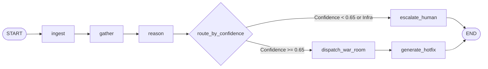

# 🔄 LangGraph Cyclical State Machine Guide

Incident Commander organizes multi-agent execution using **LangGraph**, providing deterministic control flow, conditional state branching, and state checkpointing.

---

## 1. Graph State Definition (`IncidentGraphState`)

The state machine transitions an immutable dictionary through each phase of investigation:

```python
class IncidentGraphState(TypedDict):
    alert_payload: Dict[str, Any]
    repo: str
    alert: Optional[Dict[str, Any]]
    commits: List[Dict[str, Any]]
    candidates: List[Dict[str, Any]]
    hypothesis: Optional[Dict[str, Any]]
    slack_result: Optional[Dict[str, Any]]
    linear_result: Optional[Dict[str, Any]]
    hotfix_result: Optional[Dict[str, Any]]
    status: str
    error: Optional[str]
```

---

## 2. Graph Nodes & Edges



- **`node_ingest`**: Normalizes Sentry stack frames.
- **`node_gather`**: Fetches candidate commits from GitHub.
- **`node_reason`**: Executes 40ms pruning + local Qwen 2.5 reasoner.
- **`route_by_confidence`**: Conditional edge preventing false-positive code rollbacks.
- **`node_escalate_human`**: Posts cloud outage alert to Slack war-room and suppresses hotfix PR.
- **`node_dispatch_war_room`**: Opens Slack war-room and files Linear P0 issue.
- **`node_generate_hotfix`**: Prepares Phase 2 surgical revert PR on GitHub.

---

## 3. Running LangGraph Tests

```bash
python -m pytest tests/test_langgraph.py -v
```
Both the standard incident workflow and the conditional infrastructure outage branch are tested automatically.
