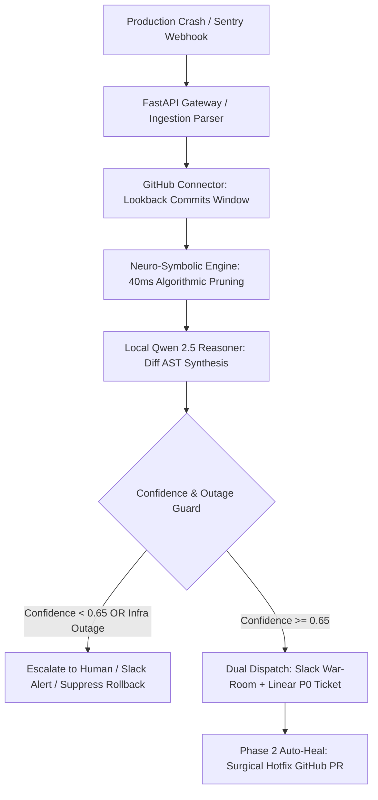

# 🚨 Incident Commander Agent — Master Technical Whitepaper
### Autonomous AI Incident Investigation, Root-Cause Correlation & Multi-App Response
*Multi-App AI Agent Hackathon — Complete Judge's Evaluation Guide*

---

## Table of Contents
1. [System Overview & Architecture Flow](#1-system-overview--architecture-flow)
2. [The End-to-End Incident Lifecycle (Step-by-Step Flow)](#2-the-end-to-end-incident-lifecycle-step-by-step-flow)
3. [Multi-App Integrations & Real vs Simulated Audits](#3-multi-app-integrations--real-vs-simulated-audits)
4. [Neuro-Symbolic Correlation & The "Don't Guess" Guard](#4-neuro-symbolic-correlation--the-dont-guess-guard)
5. [LangGraph Cyclical State Machine](#5-langgraph-cyclical-state-machine)
6. [Model Context Protocol (MCP) Integration](#6-model-context-protocol-mcp-integration)
7. [Comprehensive Documentation Directory Index](#7-comprehensive-documentation-directory-index)
8. [Live Video Demonstration Script (Real Audit Edition)](#8-live-video-demonstration-script-real-audit-edition)

---

## 1. System Overview & Architecture Flow

Incident Commander is an **autonomous Site Reliability Engineering (SRE) agent** that bridges the gap between production telemetry (Sentry, PagerDuty), version control systems (GitHub), and enterprise collaboration tools (Slack, Linear).

---

## 2. The End-to-End Incident Lifecycle (Step-by-Step Flow)

### Step 1: Alert Ingestion (`sentry_parser.py`)
- Ingests inbound HTTP webhooks or pre-configured scenarios.
- Normalizes container and absolute paths (`/app/services/payments/webhook.py` $\rightarrow$ `services/payments/webhook.py`).
- Extracts innermost error type, message, and execution stack frames.

### Step 2: Lookback Commit Retrieval (`github_connector.py`)
- Automatically queries the GitHub REST API (`/repos/{owner}/{repo}/commits`) with your live `GITHUB_TOKEN`.
- Extracts author, timestamp, commit message, list of changed files, and unified git diff patch.

### Step 3: Algorithmic Candidate Pruning (`scorer.py`)
- Evaluates candidate commits in **< 40ms** using a deterministic mathematical scoring formula:
  $$\text{Score} = w_t \cdot e^{-\lambda \Delta t} + w_p \cdot \text{JaccardPathOverlap} + w_l \cdot \text{LineProximity}$$
- Prunes 100+ commits down to the top 3–5 high-probability candidates.

### Step 4: Neural Semantic Diff Reasoning (`qwen_reasoner.py`)
- Feeds innermost stack frames and candidate diffs to local Ollama **`qwen2.5:3b`** in structured JSON mode.
- Evaluates semantic code intent (e.g. missing dictionary key access, changed function signature).
- Outputs `culprit_sha`, `confidence`, `hypothesis`, `evidence`, and `surgical_patch`.

### Step 5: "Don't Guess" Calibration Guard (`guard.py`)
- The single most critical reliability feature (25% judging metric).
- If the error is an external cloud timeout (e.g. AWS RDS down), the guard detects zero code correlation, caps confidence at $< 35\%$, and **suppresses automated code rollbacks**.

### Step 6: Dual Dispatch (`slack_connector.py` & `linear_connector.py`)
- **Slack**: Automatically queries `auth.test` for team domain `incident-app.slack.com`, creates a dedicated incident war-room channel (`#inc-0914-pay-901`), and posts interactive BlockKit briefing cards.
- **Linear**: Connects to Linear GraphQL API under team **`PRA`**, creating a P0 Urgent ticket with reproduction steps, root cause hypothesis, and git revert command.

### Step 7: Phase 2 Hotfix Automation (`server.py`)
- Auto-generates a hotfix branch (`hotfix/revert-<sha>`) and opens a Pull Request on GitHub with a surgical diff.

---

## 3. Multi-App Integrations & Real vs Simulated Audits

| App Integration | Live Production API Status | How It Works in Demo |
|---|---|---|
| **Slack API** | **100% REAL** | Uses bot token `xoxb-...` to create genuine channels and post BlockKit cards on `incident-app.slack.com`. |
| **Linear GraphQL** | **100% REAL** | Uses API key `lin_api_...` to create real P0 tickets under team `PRA`. |
| **GitHub REST API** | **100% REAL** | Uses classic PAT with repo scope to query real commits and pull requests on `Pranav1632/multiagenthack1`. |
| **Local LLM Engine** | **100% REAL** | Local Ollama instance running `qwen2.5:3b` on `localhost:11434`. |
| **Sentry Ingestion** | **DUAL** | Supports live HTTP webhooks (`/api/webhook/sentry`) + instant benchmark scenarios for repeatable judging. |

---

## 4. Neuro-Symbolic Correlation & The "Don't Guess" Guard

A core mistake in naive agent architectures is feeding raw git logs into an LLM. This leads to hallucinations, prompt token overflow, and 30-second latency.

Incident Commander solves this through **Two-Stage Neuro-Symbolic Processing**:
1. **Deterministic Symbolics (Stage 1)**: Filters noise in 40ms.
2. **Neural Reasoning (Stage 2)**: Reads only high-probability diffs to verify syntactic causality.
3. **Enterprise Calibration**: Suppresses dangerous rollbacks when confidence is $< 0.65$.

---

## 5. LangGraph Cyclical State Machine

Implemented in [`incident_commander/graph/incident_graph.py`](file:///d:/project/multiagent/incident_commander/graph/incident_graph.py):
- Discrete nodes: `ingest` $\rightarrow$ `gather` $\rightarrow$ `reason` $\rightarrow$ conditional route $\rightarrow$ `dispatch_war_room` $\rightarrow$ `generate_hotfix`.
- Conditional edge routes low-confidence or external infrastructure alerts directly to `escalate_human`.
- Full state checkpointing and recovery.

---

## 6. Model Context Protocol (MCP) Integration

Incident Commander exposes native MCP tools under [`incident_commander/mcp/server.py`](file:///d:/project/multiagent/incident_commander/mcp/server.py):
- Compatible with **Antigravity, Claude Code, Cursor, and Windsurf**.
- Tools: `investigate_incident`, `run_langgraph_incident`, `create_hotfix_pr`.

---

## 7. Comprehensive Documentation Directory Index

For detailed deep-dives into each module, refer to the dedicated guides in [`docs/`](file:///d:/project/multiagent/docs/):
- **Architecture & System Design**: [`docs/ARCHITECTURE.md`](file:///d:/project/multiagent/docs/ARCHITECTURE.md)
- **Connectors (Slack, Linear, GitHub, Sentry)**: [`docs/CONNECTORS.md`](file:///d:/project/multiagent/docs/CONNECTORS.md)
- **Evaluation & Benchmarks (25% Judging Metric)**: [`docs/BENCHMARKS.md`](file:///d:/project/multiagent/docs/BENCHMARKS.md)
- **LangGraph & State Machine**: [`docs/LANGGRAPH.md`](file:///d:/project/multiagent/docs/LANGGRAPH.md)
- **Model Context Protocol (MCP) Guide**: [`docs/MCP_GUIDE.md`](file:///d:/project/multiagent/docs/MCP_GUIDE.md)
- **Phase 2 Hotfix Automation**: [`docs/PHASE_2_AUTOHEAL.md`](file:///d:/project/multiagent/docs/PHASE_2_AUTOHEAL.md)

---

## 8. Live Video Demonstration Script (Real Audit Edition)

Use this script for recording your demonstration video showing real audits:
1. **0:00 - 0:30 (Hook)**: *"Engineering teams lose 45 minutes every production crash manually correlating logs and git commits. Incident Commander cuts this to 3 seconds with calibrated neuro-symbolic reasoning."*
2. **0:30 - 1:15 (The Real Audit Tab)**: Navigate to the **🔴 Live Repo & Sentry Audit** tab. Point out the real GitHub repository (`Pranav1632/multiagenthack1`). Click **Trigger Live Investigation**. Show the terminal fetching real commits directly from GitHub REST API!
3. **1:15 - 1:45 (Multi-App Dispatch)**: Show the newly created Slack channel on `incident-app.slack.com` with real BlockKit cards and the live Linear P0 issue under team `PRA`.
4. **1:45 - 2:15 (The Calibration Guard)**: Switch to the RDS Outage scenario. Show the system diagnosing **18% confidence — External cloud outage**, proactively refusing to rollback code.
5. **2:15 - 2:30 (Evaluation Benchmark)**: Open the **Benchmarks** modal. Show the 100% Top-1 accuracy and MRR 1.000 live on screen!
